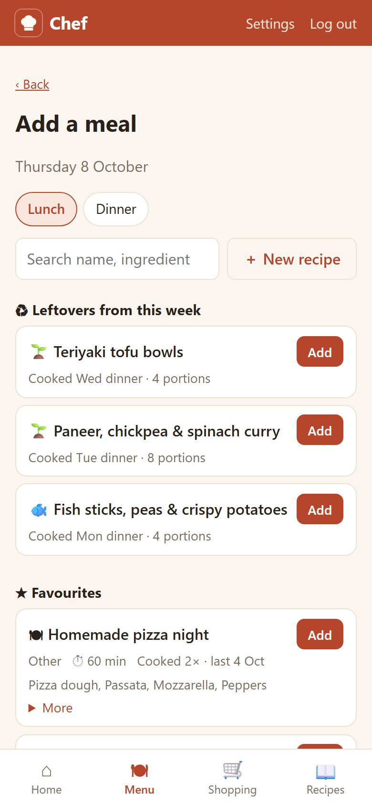
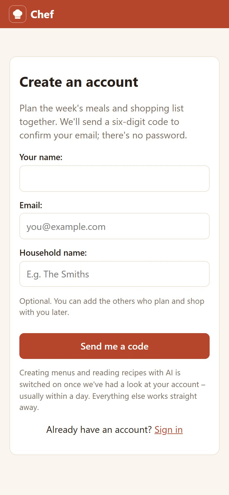
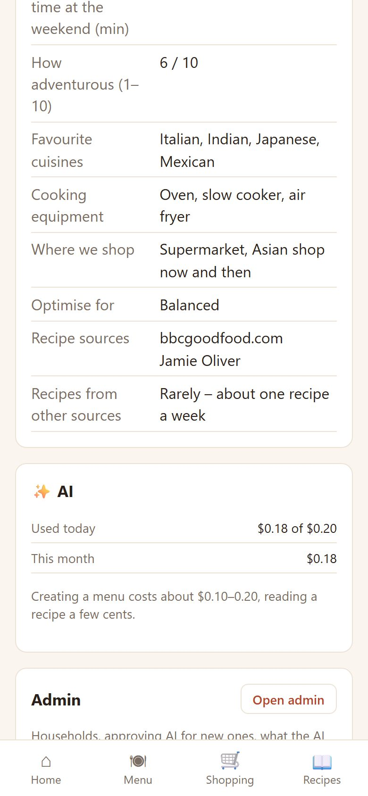
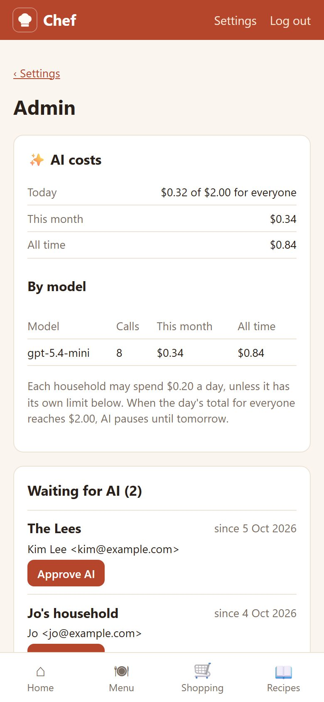

# Chef

Small Django app to plan a family's meals for the week and share the shopping list.
Several households can use it, each with their own data. Runs on the NAS as a Docker container,
data in SQLite. Works on the phone and can be added to the home screen. Vibecoded with Claude Opus 5.5.

## Screenshots

Phone screens with made-up demo data (all names and households are fictional).

<table>
  <tr>
    <td align="center"><br><sub><b>Home</b> – today and the days ahead</sub></td>
    <td align="center"><br><sub><b>Menu</b> – the week, swipe between weeks</sub></td>
    <td align="center"><br><sub><b>Shopping</b> – merged, scaled, synced ticks</sub></td>
  </tr>
  <tr>
    <td align="center"><br><sub><b>Recipes</b> – the binder</sub></td>
    <td align="center"><br><sub><b>A recipe</b> – read from a magazine photo</sub></td>
    <td align="center"><br><sub><b>Create menu</b> – who eats when</sub></td>
  </tr>
  <tr>
    <td align="center"><br><sub><b>Add a recipe</b> – link, photos or typed</sub></td>
    <td align="center"><br><sub><b>Settings</b> – people, family, rules</sub></td>
    <td align="center"><br><sub><b>Add a meal</b> – pick a recipe for a day</sub></td>
  </tr>
  <tr>
    <td align="center"><br><sub><b>Register</b> – a new household</sub></td>
    <td align="center"><br><sub><b>AI use</b> – today and this month</sub></td>
    <td align="center"><br><sub><b>Admin</b> – approvals, costs, limits</sub></td>
  </tr>
</table>

## What it does

- **Home** – today's meals and the rest of the week (on Sundays: next Monday to Friday), with one-tap feedback.
- **Menu** – the week's meals as cards (recipe link, cooking time, portions, notes); swipe or use ‹ › to change
  week. A day's **+ Add** picks a recipe we have (search by name, ingredient or notes; favourites first; leftovers
  from earlier that week) or adds a new one by link, photo or typing. Meals can also be copied from a past week
  or planned with AI.
- **Shopping** – the week's list, built from the menu's ingredients: merged across recipes, scaled to the
  portions planned, grouped by section, with the meals each item is for. Ticks sync between phones.
  Items set to come **every week** (fruit, bread, snacks...) are added automatically; *Remove this week* leaves
  one out for a single week. Staples go to "Check at home": **🫙 Always have it** (pantry and speciality items) and **❄️ Always in the
  freezer** (frozen items) add an item to the staples; these buttons can be hidden with *Hide buttons*,
  like *Hide meals* and *Hide bought*.
- **Recipes** – the recipe binder: ★ favourites, recipes we found and want to try, and every dish cooked, with
  history and feedback. Add recipes, add them to a menu, star a dish from any meal card. A recipe to try that
  everyone likes becomes a favourite; AI planning reuses favourites and works in recipes to try.
  **+ Add recipe** offers three ways: **🔗 from a link** (the page's recipe data or text is read by AI; sites
  that block downloads are opened by the AI's web search; on Android, *Share → Chef* fills in the link),
  **📷 from photos** (magazine, cookbook, handwritten card; plus a link if it's also online), or **✍️ typed in**.
  You check everything the AI read before it's saved. Recipes without a web page keep their method and photos.
- **Settings** (top right) – the people in the household, family members (likes, dislikes, allergies), the usual
  week (which meals, who eats), planning rules, pantry and freezer staples, menu creation settings (cooking times,
  cuisines, recipe sources...) and the household's AI use. All of it, plus past menus and feedback, goes into AI
  planning.

## Households

Everything (menus, recipes, shopping lists, family members, settings) belongs to a household, and everyone in a
household sees and changes the same data. Each email address belongs to one household.

- **Registering** (`/accounts/register/`, linked from the login page): name, email and an optional household
  name. The account is created once the emailed code is entered. The new household can use the app straight
  away; **AI** (menus, reading recipes) starts once an admin approves it. Admins get an email for every new
  household. `REGISTRATION_OPEN=false` closes registration; households can then only be added with `adduser`.
- **People** (Settings): anyone in the household can add someone by email (they get an email and log in with
  a code) or remove someone; removing deletes their login (admins keep theirs, in a household of their own).
  The last person can't be removed.
- **Admin** (Settings → Admin, `/manage/`, for staff users): households waiting for AI, every household's AI
  costs today, this month and in total, costs by model, approving or switching off AI, a household's own
  daily limit, and suspending a household (its members can't log in).
- **AI costs** are written to a ledger for every call to OpenAI, also when a request fails or is discarded.
  Each household may spend `AI_DAILY_LIMIT_USD` (default 0.20) a day, unless the admin page gives it another
  limit (0 switches its AI off), and all households together `AI_GLOBAL_DAILY_LIMIT_USD` (default 2.00).
  The limits are checked before a request starts, so a running one can end a day slightly above them.
  Settings shows each household what it used today and this month.

## AI menu planning

**✨ Create menu** on the week page asks which meals are needed and who eats them (prefilled from the
usual week) and for notes about the week. An OpenAI model (`AI_MODEL`, default `gpt-5.4-mini`) then plans
the meals in the background through the Responses API, searches the web for recipes and returns them
through a strict function schema; they are saved as normal dishes, ingredients and meals, so the
shopping list follows. See `meals/planner.py`.

- Needs `OPENAI_API_KEY` (from platform.openai.com; API use is billed separately from a ChatGPT
  subscription). Without it the feature is switched off.
- For better (and pricier) plans set `AI_MODEL=gpt-6.1-sol` or OpenAI's flagship `gpt-6-astra`.
  `AI_EFFORT` sets the reasoning effort (low, medium, high, xhigh).
- **Change menu** re-plans a week that already has meals; **↻** on a meal card replaces just that dish (and
  its leftovers) after asking why. Creating or changing the menu rewrites the week's "About this menu";
  replacing a dish keeps it.
- **Recipe sources** (household settings) are websites or names, searched first; with "recipes from other
  sources: never" and only websites listed, the web search is limited to those sites. The week page shows
  how many recipes came from your recipe websites.
- Recipe links are cleaned up (e.g. `tollbit.` hosts) and dropped if the page doesn't exist.
- Everyone in the household, including the person who asked, gets an email when a menu is created or changed (`MENU_EMAILS`, links use
  `SITE_URL` or the first `CSRF_TRUSTED_ORIGINS` entry).
- Recipe links are only fetched from public web addresses, never from devices on the home network.
- Recipe photos are scaled down on the phone and again on the server (max 2000 px, metadata removed), stored
  in `data/media` and only shown to the household's members. Reading one costs about a cent with `gpt-5.4-mini`.
- Each request's prompt, raw answer, token counts, web searches and cost are in the database admin (Menu
  requests); every call's cost is in AI usage. Daily limits: see [Households](#households).
  A request has 12 minutes; after 15 it counts as stalled and saves nothing.

## Assistants (Claude, ChatGPT...)

Chef is an MCP server, so an assistant that supports MCP connectors can use a household's menus, shopping
list and recipes ("add oat milk to this week's list", "what's for dinner on Thursday?", "plan the lasagne
for Saturday").

- **Connect:** Settings → 🤖 Assistants shows the address, e.g. `https://chef.example.com/mcp`. In Claude:
  Settings → Connectors → Add custom connector (on claude.ai or the desktop app; it's then available on the
  phone too), paste the address, Connect. The assistant opens Chef: log in with the emailed code and allow it.
  The client ID / secret fields stay empty.
- **Tools:** `get_week_menu`, `plan_meal`, `remove_meal`, `copy_week`, `get_shopping_list`, `add_item`,
  `remove_item`, `tick_item`, `search_recipes`, `get_recipe`, `rate_meal` (`connect/tools.py`). They use the
  same code as the web pages (`meals/services.py`) and only ever see the connected person's household.
  Changes show up for everyone straight away; the assistant's own AI does the thinking, so it costs Chef nothing.
- **OAuth 2.1** (`connect/oauth.py`): discovery through `/.well-known/oauth-protected-resource` and
  `/.well-known/oauth-authorization-server`, dynamic client registration (`/oauth/register`, limited per IP;
  unused registrations are removed after a day), authorization with PKCE (S256) and a consent page, access
  tokens for an hour, refresh tokens for 60 days (replaced on every use), revocation. Only hashes of codes and
  tokens are stored. Redirect addresses must be https (or http on localhost).
- **Disconnect** an assistant in Settings → 🤖 Assistants (anyone in the household can). A suspended household's
  assistants stop working. Each connection may make 120 calls a minute.

## Login

There are no passwords. A user enters their email and gets a six-digit code (valid 10 minutes).
Only users that already exist (registered, added by someone in their household or with `adduser`) can log in.
At most 5 codes are sent per address every 15 minutes. From the command line:

```sh
python manage.py adduser you@example.com --name "You" --admin            # admin; their household may use AI
python manage.py adduser partner@example.com --name "Partner" --join you@example.com   # same household
```

If `EMAIL_HOST` is not set, emails are printed to the console / container logs.

## Local development

```powershell
python -m venv .venv
.\.venv\Scripts\pip install -r requirements.txt
$env:DEBUG = "true"
.\.venv\Scripts\python manage.py migrate
.\.venv\Scripts\python manage.py adduser you@example.com --admin
.\.venv\Scripts\python manage.py runserver
```

Open http://127.0.0.1:8000, enter your email, and copy the code from the terminal output.

Run tests with `python manage.py test` (with `DEBUG=true`).

`requirements.in` lists the direct dependencies; `requirements.txt` pins every version the image is built
with. Dependabot proposes monthly updates as pull requests, which only publish an image once tests pass.

## Docker / NAS

```sh
cp .env.example .env   # set SECRET_KEY, ALLOWED_HOSTS, CSRF_TRUSTED_ORIGINS, SMTP...
docker compose up -d --build
```

- To try the image locally over http://localhost:8061 (separate database in `./data-local`;
  browsers refuse port 5061, which is only used behind the NAS reverse proxy):
  `docker compose -f docker-compose.yml -f docker-compose.local.yml up -d --build`
- The SQLite database lives in `./data` (mounted at `/data`); back up that whole folder. It runs in WAL
  mode, so `db.sqlite3-wal` and `db.sqlite3-shm` belong to it. Recipe photos are in `data/media`.
  The container runs as UID 1000, so that folder must be writable for it.
- Migrations run automatically on container start.
- `INITIAL_ADMIN_EMAIL` in `.env` creates the first admin user on startup (in a household of their own,
  allowed to use AI).
- Upgrading from the single-family version: the first migration puts all existing data and users into one
  household ("Our family", AI allowed). Rename it in Settings; an admin account that isn't part of the family
  can be removed there (it keeps its login, in a household of its own).
- Health check: `GET /health/`.
- Run management commands with `docker compose exec chef python manage.py <command>`.

## Synology (Container Manager) via GitHub

Every push to `main` runs the tests and publishes the image `ghcr.io/<owner>/<repo>:latest`
(see `.github/workflows/docker.yml`). The NAS only pulls that image; all settings are
environment variables in the NAS project and never in git.

1. First time only: on GitHub → your profile → Packages → the package → Package settings →
   Change visibility → Public (so the NAS can pull without a token).
2. File Station: create the folders `/docker/chef` and `/docker/chef/data` (Synology doesn't create
   missing bind-mount folders).
3. Container Manager → Project → Create: name `chef`, path `/docker/chef`, source
   "Create docker-compose.yml", paste `deploy/docker-compose.nas.yml` and fill in the values.
4. DSM reverse proxy: `https://chef.example.com:443` → `http://localhost:5061`, custom header
   `X-Forwarded-Proto: https`, Let's Encrypt certificate assigned.
5. Updates: push to `main`, wait for the GitHub Action, then in Container Manager → Project → chef:
   Stop → Build → Start. `pull_policy: always` in the compose file makes this fetch the new `latest`.
   `https://<host>/health/` shows the commit the running image was built from. Settings are changed in the same project
   (Edit the YAML), followed by a restart.
6. Back up `/docker/chef/data` (e.g. Hyper Backup).

## Layout

- `config/` – settings (all configured through environment variables), URLs, WSGI
- `accounts/` – email-based user model, login codes (rate limited), registration, `adduser` command
- `meals/` – households, menu, shopping list, family and AI planning
  - `models.py` – `Household` owns everything; `middleware.py` sets `request.household` for every page
  - `views/` – `menu.py`, `shopping.py`, `family.py` (settings), `people.py`, `planning.py`, `recipes.py`,
    `manage.py` (admin page), shared helpers in `common.py`
  - `planner.py` – prompt, OpenAI call, link checks and saving the menu; `notify.py` – emails
  - `budget.py` – the AI cost ledger and daily limits
  - `services.py` – changes and lookups shared by the web pages and the assistant tools
- `connect/` – assistants: the MCP endpoint (`mcp.py`), its tools (`tools.py`) and OAuth (`oauth.py`)
  - `recipe_import.py` – reading recipes from photos; `photos.py` – scaling and cleaning photos
  - `shopping.py` – building the list; `schedule.py` – the usual week and the meals grid
- `core/` – health check, web app manifest, service worker
- `templates/`, `static/` – base template, CSS, `js/app.js`, icons
