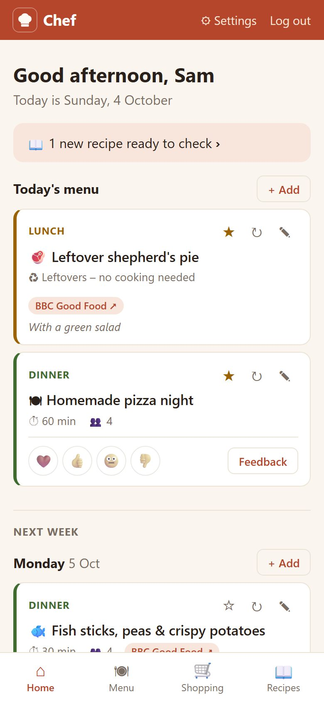
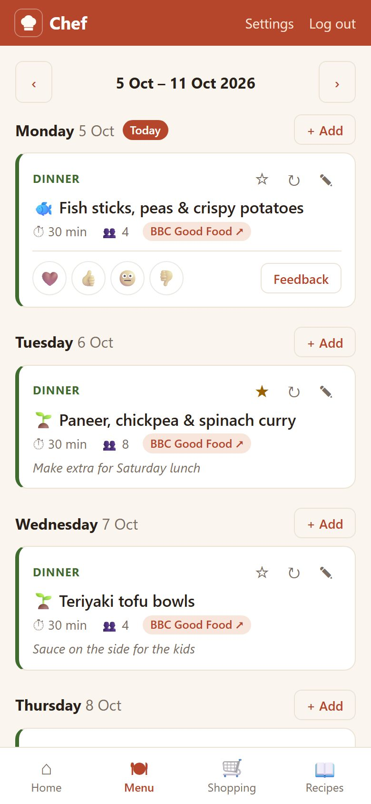
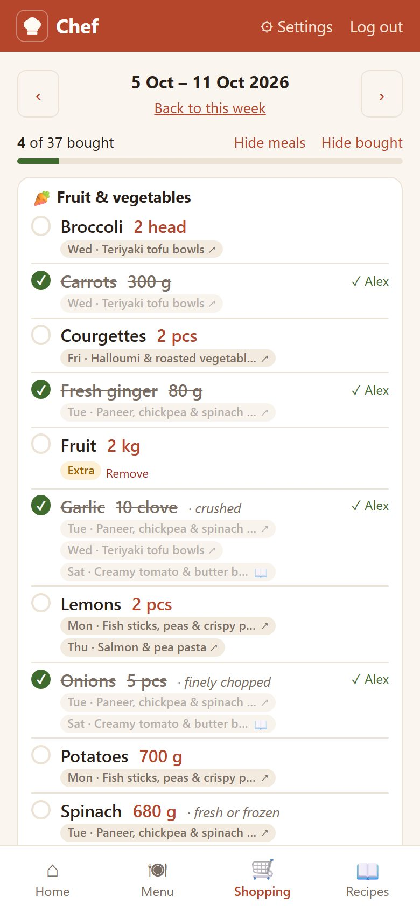
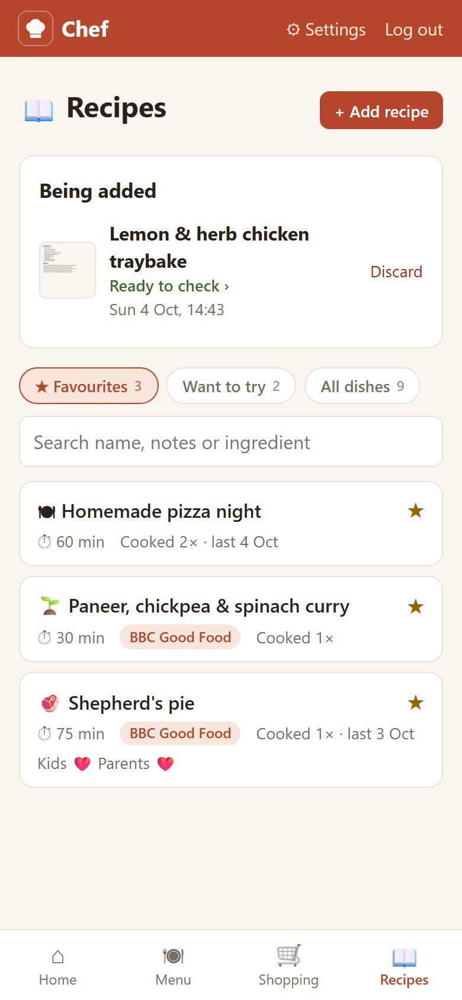
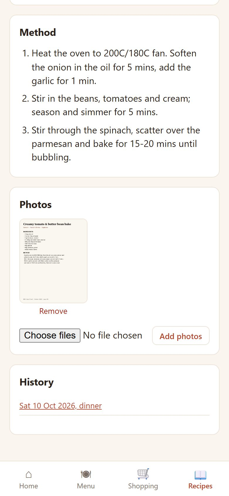
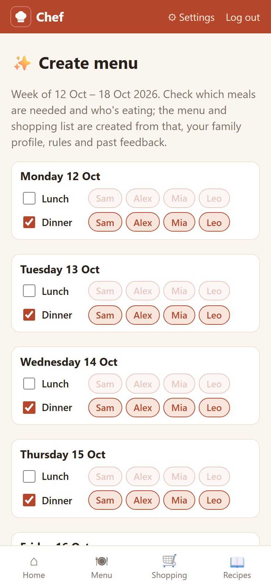
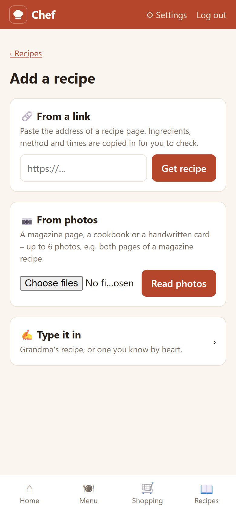
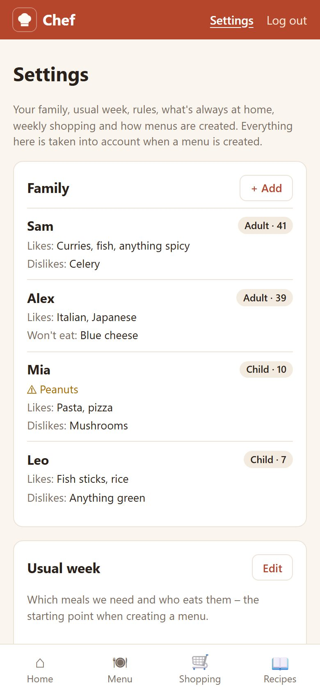

# Chef

Small Django app to plan our family's meals for the week and share the shopping list.
Runs on the NAS as a Docker container, data in SQLite. Works on the phone and can be added
to the home screen. Vibecoded with Claude Opus 5.5.

## Screenshots

Phone screens with made-up demo data.

<table>
  <tr>
    <td align="center"><br><sub><b>Home</b> – today and the days ahead</sub></td>
    <td align="center"><br><sub><b>Menu</b> – the week, swipe between weeks</sub></td>
    <td align="center"><br><sub><b>Shopping</b> – merged, scaled, synced ticks</sub></td>
  </tr>
  <tr>
    <td align="center"><br><sub><b>Recipes</b> – the binder</sub></td>
    <td align="center"><br><sub><b>A recipe</b> – read from a magazine photo</sub></td>
    <td align="center"><br><sub><b>Create menu</b> – who eats when</sub></td>
  </tr>
  <tr>
    <td align="center"><br><sub><b>Add a recipe</b> – link, photos or typed</sub></td>
    <td align="center"><br><sub><b>Settings</b> – family, rules, household</sub></td>
    <td></td>
  </tr>
</table>

## What it does

- **Home** – today's meals and the rest of the week (on Sundays: next Monday to Friday), with one-tap feedback.
- **Menu** – the week's meals as cards (recipe link, cooking time, portions, notes); swipe or use ‹ › to change
  week. Meals can be added, changed or removed by hand, copied from a past week, or planned with AI.
- **Shopping** – the week's list, built from the menu's ingredients: merged across recipes, scaled to the
  portions planned, grouped by section, with the meals each item is for. Ticks sync between phones.
- **Recipes** – the recipe binder: ★ favourites, recipes we found and want to try, and every dish cooked, with
  history and feedback. Add recipes, add them to a menu, star a dish from any meal card. A recipe to try that
  everyone likes becomes a favourite; AI planning reuses favourites and works in recipes to try.
  **+ Add recipe** offers three ways: **🔗 from a link** (the page's recipe data or text is read by AI; sites
  that block downloads are opened by the AI's web search; on Android, *Share → Chef* fills in the link),
  **📷 from photos** (magazine, cookbook, handwritten card; plus a link if it's also online), or **✍️ typed in**.
  You check everything the AI read before it's saved. Recipes without a web page keep their method and photos.
- **Settings** (top right) – family members (likes, dislikes, allergies), the usual week (which meals, who eats),
  planning rules and household settings. All of it, plus past menus and feedback, goes into AI planning.

## AI menu planning

**✨ Create menu** on the week page asks which meals are needed and who eats them (prefilled from the
usual week) and for notes about the week. An OpenAI model (`AI_MODEL`, default `gpt-5.4-mini`) then plans
the meals in the background through the Responses API, searches the web for recipes and returns them
through a strict function schema; they are saved as normal dishes, ingredients and meals, so the
shopping list follows. See `meals/planner.py`.

- Needs `OPENAI_API_KEY` (from platform.openai.com; API use is billed separately from a ChatGPT
  subscription). Without it the feature is switched off.
- For better (and pricier) plans set `AI_MODEL=gpt-6.1-sol` or OpenAI's flagship `gpt-6-astra`.
  `AI_EFFORT` sets the reasoning effort (low, medium, high, xhigh).
- **Change menu** re-plans a week that already has meals; **↻** on a meal card replaces just that dish (and
  its leftovers) after asking why. Neither changes the week's "About this menu".
- **Recipe sources** (household settings) are websites or names, searched first; with "recipes from other
  sources: never" and only websites listed, the web search is limited to those sites. The week page shows
  how many recipes came from your recipe websites.
- Recipe links are cleaned up (e.g. `tollbit.` hosts) and dropped if the page doesn't exist.
- The rest of the family gets an email when a menu is created or changed (`MENU_EMAILS`, links use
  `SITE_URL` or the first `CSRF_TRUSTED_ORIGINS` entry).
- Recipe links are only fetched from public web addresses, never from devices on the home network.
- Recipe photos are scaled down on the phone and again on the server (max 2000 px, metadata removed), stored
  in `data/media` and only shown to logged-in users. Reading one costs about a cent with `gpt-5.4-mini`.
- Each request's prompt, raw answer, token counts, web searches and cost are in the admin (Menu requests).
  A request has 12 minutes; after 15 it counts as stalled and saves nothing.

## Login

There are no passwords. A user enters their email and gets a six-digit code (valid 10 minutes).
Only users that already exist can log in. At most 5 codes are sent per address every 15 minutes. Add them with:

```sh
python manage.py adduser you@example.com --name "You" --admin    # with admin access
python manage.py adduser partner@example.com --name "Partner"
```

or via the Django admin at `/admin/`. If `EMAIL_HOST` is not set, emails are printed to the console / container logs.

## Local development

```powershell
python -m venv .venv
.\.venv\Scripts\pip install -r requirements.txt
$env:DEBUG = "true"
.\.venv\Scripts\python manage.py migrate
.\.venv\Scripts\python manage.py adduser you@example.com --admin
.\.venv\Scripts\python manage.py runserver
```

Open http://127.0.0.1:8000, enter your email, and copy the code from the terminal output.

Run tests with `python manage.py test` (with `DEBUG=true`).

`requirements.in` lists the direct dependencies; `requirements.txt` pins every version the image is built
with. Dependabot proposes monthly updates as pull requests, which only publish an image once tests pass.

## Docker / NAS

```sh
cp .env.example .env   # set SECRET_KEY, ALLOWED_HOSTS, CSRF_TRUSTED_ORIGINS, SMTP...
docker compose up -d --build
```

- To try the image locally over http://localhost:8061 (separate database in `./data-local`;
  browsers refuse port 5061, which is only used behind the NAS reverse proxy):
  `docker compose -f docker-compose.yml -f docker-compose.local.yml up -d --build`
- The SQLite database lives in `./data` (mounted at `/data`); back up that whole folder. It runs in WAL
  mode, so `db.sqlite3-wal` and `db.sqlite3-shm` belong to it. Recipe photos are in `data/media`.
  The container runs as UID 1000, so that folder must be writable for it.
- Migrations run automatically on container start.
- `INITIAL_ADMIN_EMAIL` in `.env` creates the first admin user on startup.
- Health check: `GET /health/`.
- Run management commands with `docker compose exec chef python manage.py <command>`.

## Synology (Container Manager) via GitHub

Every push to `main` runs the tests and publishes the image `ghcr.io/<owner>/<repo>:latest`
(see `.github/workflows/docker.yml`). The NAS only pulls that image; all settings are
environment variables in the NAS project and never in git.

1. First time only: on GitHub → your profile → Packages → the package → Package settings →
   Change visibility → Public (so the NAS can pull without a token).
2. File Station: create the folders `/docker/chef` and `/docker/chef/data` (Synology doesn't create
   missing bind-mount folders).
3. Container Manager → Project → Create: name `chef`, path `/docker/chef`, source
   "Create docker-compose.yml", paste `deploy/docker-compose.nas.yml` and fill in the values.
4. DSM reverse proxy: `https://chef.example.com:443` → `http://localhost:5061`, custom header
   `X-Forwarded-Proto: https`, Let's Encrypt certificate assigned.
5. Updates: push to `main`, wait for the GitHub Action, then in Container Manager → Project → chef:
   Stop → Build → Start. `pull_policy: always` in the compose file makes this fetch the new `latest`.
   `https://<host>/health/` shows the commit the running image was built from. Settings are changed in the same project
   (Edit the YAML), followed by a restart.
6. Back up `/docker/chef/data` (e.g. Hyper Backup).

## Layout

- `config/` – settings (all configured through environment variables), URLs, WSGI
- `accounts/` – email-based user model, login codes (rate limited), `adduser` command
- `meals/` – menu, shopping list, family and AI planning
  - `views/` – `menu.py`, `shopping.py`, `family.py`, `planning.py`, shared helpers in `common.py`
  - `planner.py` – prompt, OpenAI call, link checks and saving the menu; `notify.py` – menu emails
  - `recipe_import.py` – reading recipes from photos; `photos.py` – scaling and cleaning photos
  - `shopping.py` – building the list; `schedule.py` – the usual week and the meals grid
- `core/` – health check, web app manifest, service worker
- `templates/`, `static/` – base template, CSS, `js/app.js`, icons
